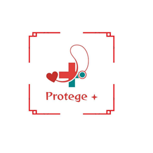

# Projeto PROTEGE API

## Descrição do Projeto

Este repositório contém o código-fonte de uma aplicação web CRUD (Create, Read, Update, Delete) desenvolvida como parte da avaliação da disciplina de Banco de Dados II. A aplicação, chamada **PROTEGE**, tem como objetivo gerenciar informações sobre primeiros socorros, focando em Pessoas, Enfermidades e Procedimentos Clínicos associados.

A aplicação web permite:

* Listar enfermidades e seus procedimentos clínicos associados (consulta com JOIN).
* Inserir, editar e deletar enfermidades e procedimentos.
* Listar, inserir, editar e deletar pessoas.

## Tecnologias Utilizadas

* **Backend:** Node.js com Express.js
* **Frontend (View Engine):** EJS (Embedded JavaScript templates)
* **Banco de Dados:** MySQL
* **Estilização:** Bootstrap 5 (via CDN)
* **Controle de Versão:** Git e GitHub

## Estrutura do Projeto

* **`/` (Raiz do Projeto):**
    * `app.js`: Arquivo principal da aplicação. Configura o servidor Express, define as rotas (URLs) para cada funcionalidade (listar, inserir, editar, deletar), interage com o banco de dados (através do `db.js`) e renderiza as páginas EJS.
    * `db.js`: Responsável por estabelecer e exportar a conexão com o banco de dados MySQL (`BD_PROTEGE_V6`).
    * `package.json`: Lista as dependências do projeto (Express, EJS, MySQL) e outras configurações do Node.js.
    * `package-lock.json`: Arquivo gerado pelo npm que trava as versões exatas das dependências.
    * `README.md`: Este arquivo, explicando o projeto.
    * `localhost.sql` (ou `SQL_bd_protege_v6.sql` v4): Script SQL completo para criar o banco de dados `BD_PROTEGE_V6`, suas tabelas (com correções de estrutura e tipos), popular a tabela `grupo_ciap` e realizar a carga inicial de dados nas tabelas `Enfermidade`, `Procedimentoclinico`, `Caso_Clinico` e `Pessoa`.
    
* **`/node_modules/`:** Pasta criada pelo `npm install`, contendo o código das bibliotecas de dependência (Express, EJS, MySQL, etc.).

* **`/public/`:** Pasta para arquivos estáticos (acessíveis diretamente pelo navegador).
    * `logo.png`: Arquivo de imagem da logo da aplicação.
* **`/views/`:** Pasta contendo os arquivos de template EJS, que geram o HTML exibido no navegador.
    * `head.ejs`: Template parcial contendo o cabeçalho HTML (`<head>`), a barra de navegação (menu), o favicon e a logo centralizada. É incluído em todas as outras páginas .ejs.
    * `index.ejs`: Página principal que lista as enfermidades e procedimentos (resultado do JOIN).
    * `inserir.ejs`: Formulário para cadastrar uma nova enfermidade e seu procedimento associado.
    * `editar.ejs`: Formulário pré-preenchido para editar uma enfermidade e seu procedimento.
    * `delete.ejs`: Página de confirmação para deletar um procedimento.
    * `pessoas.ejs`: Página que lista todas as pessoas cadastradas.
    * `inserir-pessoa.ejs`: Formulário para cadastrar uma nova pessoa.
    * `editar-pessoa.ejs`: Formulário pré-preenchido para editar os dados de uma pessoa.
    * `delete-pessoa.ejs`: Página de confirmação para deletar uma pessoa.

## Como Executar o Projeto

1.  **Pré-requisitos:** Certifique-se de ter o [Node.js](https://nodejs.org/) e um servidor [MySQL](https://www.mysql.com/) (como o que vem com XAMPP ou WAMP) instalados.
2.  **Banco de Dados:**
    * Abra uma ferramenta de gerenciamento MySQL (como phpMyAdmin).
    * Execute o script SQL completo (`localhost.sql`) para criar e popular o banco de dados `BD_PROTEGE_V6`.
3.  **Dependências:**
    * Clone ou baixe este repositório.
    * Abra um terminal na pasta raiz do projeto.
    * Execute o comando `npm install` para baixar as dependências listadas no `package.json`.
4.  **Configuração da Conexão:**
    * Abra o arquivo `db.js`.
    * Verifique se `host`, `user` e `password` correspondem à sua configuração local do MySQL. Lembre-se de colocar sua senha se necessário.
5.  **Executar a Aplicação:**
    * No terminal, na pasta raiz do projeto, execute: `node app.js`.
    * Abra seu navegador e acesse: `http://localhost:3000`.

## Funcionalidades Implementadas (Resumo da Avaliação)

* **Tarefa 1:** Script SQL (`localhost.sql`) cria as tabelas com as Foreign Keys obrigatórias (`Procedimentoclinico` -> `Enfermidade`, `Questao_Questionario` -> `Pessoa`, `Questao_Questionario` -> `Procedimentoclinico`).

* **Tarefa 2:** Script SQL (`localhost.sql`) popula a tabela `grupo_ciap` e realiza a carga de dados para `Enfermidade`, `Procedimentoclinico` e `Caso_Clinico`.

* **Tarefa 3:** Aplicação Node.js (`app.js` e pasta `views/`) implementa o CRUD completo para `Pessoa`, `Enfermidade` e `Procedimentoclinico`, com a consulta principal utilizando `JOIN`.
